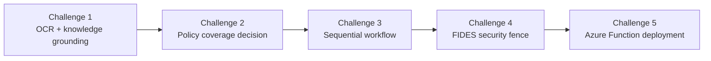

# ClaimSight Claims Microhack

This microhack walks through an end-to-end claims workflow built with Azure AI and Azure Functions.

## What you will build

You start with claim intake and document understanding, then move through policy grounding, sequential orchestration, security hardening, and finally deployment as an HTTP-triggered Azure Function.

## Challenge flow

1. [Challenge 1](./challenges/challenge-01.md) - OCR a claim statement and ground it in Azure AI Search / Foundry IQ knowledge.
2. [Challenge 2](./challenges/challenge-02.md) - Compare the claim against real policy documents and produce a coverage decision.
3. [Challenge 3](./challenges/challenge-03.md) - Combine the intake and decision agents into a sequential workflow with an optional human-review branch.
4. [Challenge 4](./challenges/challenge-04.md) - Harden the workflow against prompt injection and data exfiltration with FIDES.
5. [Challenge 5](./challenges/challenge-05.md) - Expose the secured workflow as an Azure Function with an HTTP trigger and managed identity.

## Repository layout

- `challenges/` contains the step-by-step lab instructions.
- `docs/` contains the Python scripts that support each challenge.
- `functions/` contains the Azure Functions project used in Challenge 5.
- `labautomation/` contains the deployment template and lab setup scripts.
- `data/` contains the sample claim and policy files used throughout the microhack.
- `walkthrough/` contains supporting walkthrough material.

## Before you start

- Complete the lab setup in Challenge 0 if you are running the full microhack locally.
- Use the same Azure AI Foundry project and model values across Challenges 1 through 5.
- If you run the function challenge locally, install Azure Functions Core Tools v4 and Azurite or provide a real storage connection string.

## Notes

- Challenge 3 now includes a conditional human-review branch.
- Challenge 4 builds on that workflow with deterministic security enforcement.
- Challenge 5 deploys the secured workflow behind an HTTP endpoint instead of a CLI script.

If you want to start from the beginning, open [challenge-01.md](./challenges/challenge-01.md).
