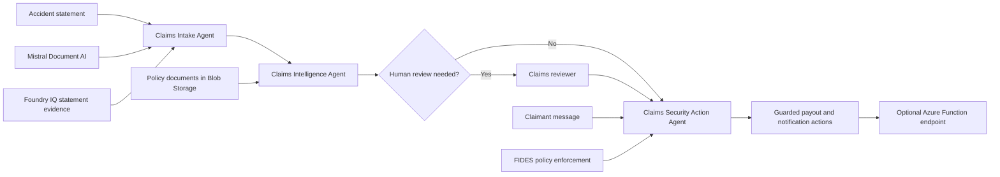
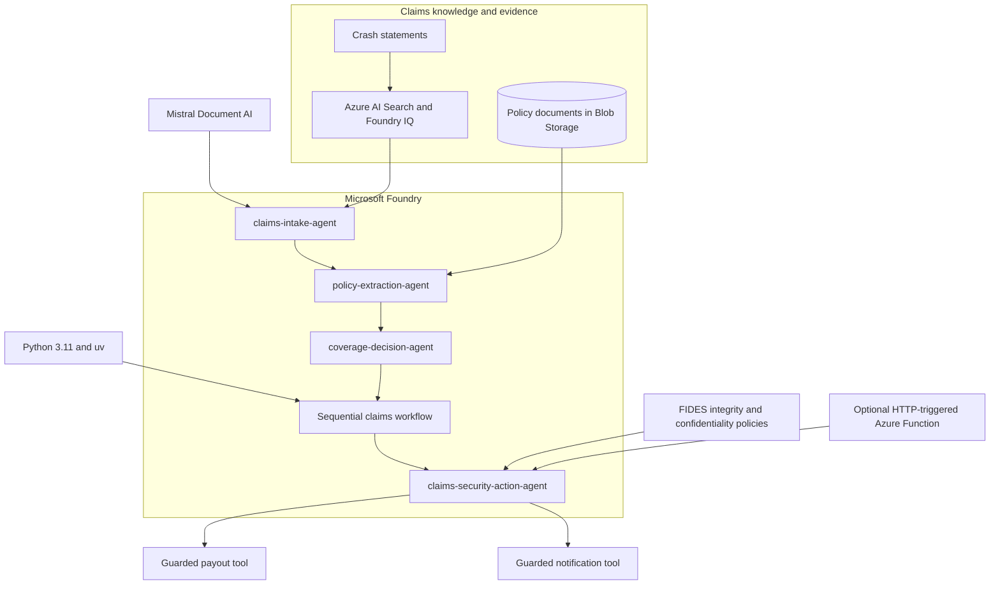

# Agentic AI Hacks |  Claims Intelligence

> ⚠️ **This repository is under construction.** All information found here is a work in progress and is likely to change at any time without prior notice.


## Introduction

Insurance claims teams must turn unstructured accident statements, policy documents,
and claimant messages into timely, defensible decisions. Manual handoffs slow that
work, while ungrounded automation can overlook policy constraints or allow untrusted
content to influence sensitive actions.

ClaimSight is an **agentic claims intelligence system** that converts scanned accident
statements into structured claim data, grounds decisions in enterprise policy
documents, coordinates specialized agents, and protects downstream actions from prompt
injection and data exfiltration. The workflow uses **Mistral Document AI**, **Foundry
IQ**, **Microsoft Foundry agents**, the **Microsoft Agent Framework**, and **FIDES**.

During this microhack, you will build a reusable Python workflow that progresses from
document intake to policy-grounded adjudication, conditional human review, deterministic
security enforcement, and optional hosting in Azure Functions.

---

## Scenario

An accident statement enters the claims system. The ClaimSight workflow must:

1. Use the **Claims Intake Agent** to extract claim details with Mistral Document AI
	 and retrieve related statement evidence through Foundry IQ.
2. Use the **Claims Intelligence Agent** to structure the matching enterprise policy
	 and produce an evidence-backed coverage decision.
3. Coordinate the intake, policy extraction, and coverage decision agents in sequence,
	 routing uncertain or escalated decisions to human review.
4. Use the **Claims Security Action Agent** and FIDES to prevent untrusted claimant
	 content from authorizing payouts or exposing private policyholder data.
5. Optionally expose the secured downstream actions through an HTTP-triggered Azure
	 Function.

The following diagram shows the claim journey and the responsibilities introduced by
the challenges:



---

## Architecture

The microhack builds a Python-based, multi-agent claims system. Microsoft Foundry
hosts the specialized agents, Foundry IQ supplies grounded statement evidence, and
Azure Blob Storage holds the source policy documents. The Microsoft Agent Framework
coordinates the workflow and applies FIDES controls before privileged tools run.



### The four agents

| Agent                        | Role                                                           | Data source or control                       | Introduced in |
|------------------------------|----------------------------------------------------------------|----------------------------------------------|---------------|
| Claims Intake Agent          | Extracts claim details and retrieves related statement context | Mistral Document AI and Foundry IQ           | Challenge 2   |
| Policy Extraction Agent      | Converts enterprise policy text into structured coverage data  | Policy documents in Azure Blob Storage       | Challenge 3   |
| Coverage Decision Agent      | Evaluates coverage, confidence, consistency, and escalation     | Structured claim and policy data             | Challenge 3   |
| Claims Security Action Agent | Attempts downstream actions within deterministic trust limits  | FIDES integrity and confidentiality policies | Challenge 5   |

> [!NOTE]
> "Claims Intelligence Agent" is the Challenge 3 application component that
> coordinates policy extraction and coverage adjudication. It is not a fifth Foundry
> agent.

---

## Learning objectives

By participating in this microhack, you will learn how to:

* Build a Microsoft Foundry agent that combines document extraction with grounded
	retrieval through Foundry IQ
* Convert enterprise policy documents into typed data for coverage adjudication
* Compose specialized agents into a sequential workflow with conditional human review
* Apply FIDES integrity and confidentiality policies to sensitive tools
* Test prompt-injection and private-data exfiltration defenses
* Optionally host secured agent actions behind an HTTP-triggered Azure Function

---

## Requirements

To complete the microhack, you will need:

* A [GitHub account](https://github.com/signup) and access to the repository
* Familiarity with Python, JSON, command-line tools, and generative AI concepts
* Python 3.11 and [uv](https://docs.astral.sh/uv/)
* Azure CLI authenticated with the event account used for the lab
* Azure resources and environment values supplied by the MicroHack platform or your
	event coach
* Azure Functions Core Tools v4 and Azurite, or an Azure Storage connection string,
	only if you run Challenge 6 locally

### Participant setup

Complete all environment preparation in
[Challenge 1: Prepare the Environment](./challenges/challenge-01.md). It covers the
Codespaces setup, dependency installation, Azure authentication, local configuration,
and validation required before beginning the build challenges.

---

## Repository structure

```text
claims-microhack/
|-- challenges/                 # Challenge instructions (challenge-01 through challenge-06)
|-- data/
|   |-- claims/                 # Raw and derived sample claim evidence
|   `-- policies/               # Sample insurance policy documents
|-- docs/                       # Python agents, workflows, and Function project
|-- labautomation/              # MicroHack provisioning and Azure deployment template
|-- walkthrough/                # Reference solutions for each challenge
|-- pyproject.toml              # Pinned participant environment
`-- README.md
```

| Path                                   | Who uses it                | Purpose                                                     |
|----------------------------------------|----------------------------|-------------------------------------------------------------|
| [`challenges/`](./challenges/)         | Attendees                  | Step-by-step instructions for the five challenges           |
| [`data/`](./data/)                     | Attendees and scripts      | Accident evidence and policy documents used by the workflow |
| [`docs/`](./docs/)                     | Attendees                  | Supplied Python agents, orchestration, and Function code    |
| [`labautomation/`](./labautomation/)   | Platform and coaches       | Per-lab provisioning and Azure Resource Manager deployment  |
| [`walkthrough/`](./walkthrough/)       | Facilitators and attendees | Reference solutions for each challenge                     |

---

## Challenges

The microhack contains one preparation challenge, four core build challenges, and one
optional hosting challenge. Each build stage extends the same end-to-end claims
workflow.

### Challenge structure

Each challenge follows a consistent learning path:

| Section              | Description                                             |
|----------------------|---------------------------------------------------------|
| Overview             | Scenario, intended outcome, and key concepts            |
| Prerequisites        | Required resources and completed earlier work           |
| Tasks                | Commands and guided steps for the challenge             |
| Expected output      | Results and artifacts used to verify the implementation |
| Validation checklist | Completion criteria                                     |
| Next step            | Transition to the next stage of the claims workflow     |

### Challenge list

| # | Challenge | Description | Duration |
|---|-----------|-------------|----------|
| 1 | [Prepare the Environment](./challenges/challenge-01.md) | Verify access to the provisioned Azure resources and development environment used throughout the microhack | 30 min |
| 2 | [Build the Claims Intake Agent](./challenges/challenge-02.md) | Process accident statements with Mistral Document AI and ground the structured intake in Foundry IQ evidence | 45 min |
| 3 | [Build the Claims Intelligence Agent](./challenges/challenge-03.md) | Structure real policy documents and produce an auditable coverage decision with confidence and consistency scores | 30 min |
| 4 | [Orchestrate the Three-Agent Claims Workflow](./challenges/challenge-04.md) | Compose intake, policy extraction, and coverage decision agents with a conditional human-review branch | 45 min |
| 5 | [Harden the Claims Pipeline Against Prompt Injection](./challenges/challenge-05.md) | Apply FIDES controls to block unauthorized payout and private-data exfiltration attempts | 60 min |
| 6 | [Optionally Host Secure Actions in Azure Functions](./challenges/challenge-06.md) | Expose the security action agent through an HTTP endpoint and repeat the injection tests | 45-60 min |

> [!TIP]
> Pause after each challenge to consider where the same patterns apply in your own
> business processes. Grounded retrieval, specialized agent orchestration, explicit
> human review, and deterministic tool controls extend beyond insurance claims.

### Solution walkthroughs

* [Challenge 2 solution](./walkthrough/challenge-02/solution-02.md)
* [Challenge 3 solution](./walkthrough/challenge-03/solution-03.md)
* [Challenge 4 solution](./walkthrough/challenge-04/solution-04.md)
* [Challenge 5 solution](./walkthrough/challenge-05/solution-05.md)
* [Challenge 6 solution](./walkthrough/challenge-06/solution-06.md)

---

## Contributing

This project welcomes contributions and suggestions. Most contributions require you to
agree to a Contributor License Agreement (CLA) declaring that you have the right to,
and do, grant us the rights to use your contribution. For details, visit the
[Microsoft CLA website](https://cla.opensource.microsoft.com/).

This project has adopted the
[Microsoft Open Source Code of Conduct](https://opensource.microsoft.com/codeofconduct/).
For more information, see the
[Code of Conduct FAQ](https://opensource.microsoft.com/codeofconduct/faq/) or contact
[opencode@microsoft.com](mailto:opencode@microsoft.com).

## Trademarks

This project may contain trademarks or logos for projects, products, or services.
Authorized use of Microsoft trademarks or logos is subject to the
[Microsoft Trademark and Brand Guidelines](https://www.microsoft.com/legal/intellectualproperty/trademarks/usage/general).
Use of Microsoft trademarks or logos in modified versions of this project must not
cause confusion or imply Microsoft sponsorship. Any use of third-party trademarks or
logos is subject to those third parties' policies.
