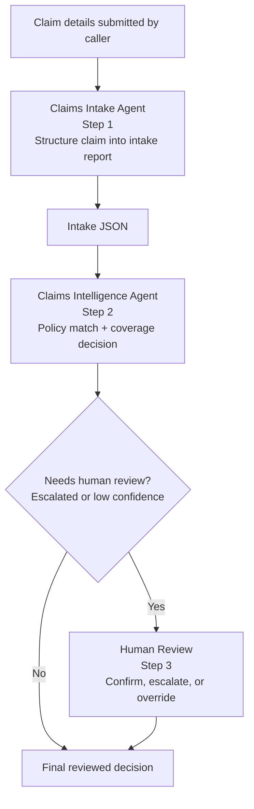

# Challenge 3 - Build the Sequential Claims Processing Workflow

**Expected Duration:** 75 minutes

## Overview

In this challenge you will wire the two agents from Challenges 1 and 2 into a single sequential workflow using **Microsoft Agent Framework** — the next-generation successor to Semantic Kernel and AutoGen.

The workflow uses the Functional Workflow API (`@workflow` + `@step` decorators), which lets you express multi-agent orchestration as plain Python async functions with no graph configuration required.

## From Two Agents to One Sequential Workflow

Challenge 1 created the Claims Intake Agent and Challenge 2 created the Claims Intelligence Agent. Challenge 3 connects those two agents into a single orchestration layer so the intake output becomes the intelligence input without manual handoff code.

In short: **claim details → Claims Intake Agent → intake JSON → Claims Intelligence Agent → conditional human review → final coverage decision**. The workflow is the glue that preserves ordering, keeps the handoff explicit, and lets the second agent reuse the structured output from the first while still allowing a person to confirm higher-risk decisions.

The workflow executes two core steps in strict order, with a conditional third human-review step when the coverage decision needs confirmation:



1. **Claims Intake Agent** — structures the claim details into a clean intake JSON report.
2. **Claims Intelligence Agent** — receives the intake report, matches the policy, validates coverage, and emits a decision that may require human confirmation.
3. **Human Review** — only runs when the decision is low-confidence or escalated and needs a person to confirm, escalate, or override the result.

```
claim details (submitted by caller)
     │
     ▼
┌─────────────────────┐
│  Claims Intake Agent │  (Step 1) Structure claim into intake report
└─────────┬───────────┘
          │  intake JSON
          ▼
┌──────────────────────────────┐
│  Claims Intelligence Agent   │  (Step 2) Policy match + Coverage decision
└──────────────────────────────┘
          │  coverage decision (APPROVED / DENIED / ESCALATED)
        ▼
┌──────────────────────────────┐
│   Human Review (conditional) │  (Step 3) Confirm, escalate, or override
└─────────┬────────────────────┘
        │  final reviewed decision
          ▼
     workflow output
```

## Prerequisites

- Complete [Challenge 1](./challenge-01.md) and [Challenge 2](./challenge-02.md).
- Install the Microsoft Agent Framework and Azure Identity:

```bash
pip install agent-framework azure-identity
```

- `FOUNDRY_PROJECT_ENDPOINT` and `FOUNDRY_MODEL` must be present in your `.env`.


## Task 1: Understand the workflow and human review branch (no action required)

`docs/claims-sequential-workflow.py` uses three Microsoft Agent Framework primitives:

**`FoundryChatClient.as_agent()`** creates each agent backed by your Foundry deployment.

```python
from agent_framework.foundry import FoundryChatClient
from azure.identity.aio import DefaultAzureCredential

async with DefaultAzureCredential() as credential:
    client = FoundryChatClient(
        credential=credential,
        project_endpoint=FOUNDRY_PROJECT_ENDPOINT,
        model=FOUNDRY_MODEL,
    )
    intake_agent       = client.as_agent(name="claims-intake-agent",       instructions=INTAKE_INSTRUCTIONS)
    intelligence_agent = client.as_agent(name="claims-intelligence-agent", instructions=INTELLIGENCE_INSTRUCTIONS)
```

**`@step`** wraps each agent call so its result is cached on checkpoint restores and HITL resumes.

```python
from agent_framework import step

@step
async def run_intake(details: str) -> str:
    return (await intake_agent.run(details)).text

@step
async def run_intelligence(intake_report: str) -> str:
    return (await intelligence_agent.run(
        f"Intake report:\n\n{intake_report}\n\nValidate coverage and return decision."
    )).text
```

**`@workflow`** composes the steps into a named sequential pipeline using plain Python control flow.

```python
from agent_framework import workflow

@workflow(name="claims-sequential-workflow")
async def claims_pipeline(details: str) -> str:
    intake_report = await run_intake(details)              # Step 1
    decision      = await run_intelligence(intake_report)  # Step 2
    return decision

result = await claims_pipeline.run(claim_details)
print(result.text)
```

The workflow adds a conditional human-in-the-loop branch after the intelligence step. If the decision is escalated or falls below the configured confidence threshold, the workflow pauses and prompts a person to approve, escalate, or deny the decision before returning the final output.

## Task 2: Run the sequential workflow

```bash
cd docs
python claims-sequential-workflow.py --policy COMP-AUTO-001
```

Override any claim field from the command line:

```bash
python claims-sequential-workflow.py \
    --policy COMM-AUTO-001 \
    --claim-id CLM-2026-007 \
    --amount 28000 \
    --damage "Rear-end collision. Bumper and trunk damaged." \
    --vehicle "2023 Ford Explorer" \
    --date 2026-07-20
```

Test the denial path with a liability-only policy against a collision claim:

```bash
python claims-sequential-workflow.py --policy LIAB-AUTO-001 --amount 95000
```

If the decision is escalated or low-confidence, the workflow prompts for human confirmation in the terminal before it prints the final result.

## How the workflow operates

| Component | Role |
|---|---|
| `FoundryChatClient` | Connects both agents to your Azure AI Foundry project and model deployment |
| `DefaultAzureCredential` (async) | Authenticates via Azure CLI, managed identity, or environment credentials |
| `@step run_intake` | Runs the Claims Intake Agent; result cached across HITL resumes and checkpoints |
| `@step run_intelligence` | Runs the Claims Intelligence Agent with the intake report as input; result cached |
| `@step run_human_review` | Prompts for human confirmation when the coverage decision is escalated or low-confidence |
| `@workflow claims_pipeline` | Composes the intake, intelligence, and conditional human review steps using plain Python |
| `claims_pipeline.run(...)` | Executes the pipeline and returns a `WorkflowRunResult` |
| `result.text` | The final reviewed decision text |

The `@step` decorator is what enforces the sequential guarantee: `run_intelligence` is only called after `run_intake` returns its result, and `run_human_review` only runs when the decision needs confirmation. No YAML, no graph configuration, no thread management required.

## Expected console output

```
Claims Sequential Workflow (Microsoft Agent Framework)
  Endpoint : https://<resource>.services.ai.azure.com/api/projects/<project>
  Model    : gpt-5.4
  Policy   : COMP-AUTO-001
  Claim ID : CLM-2026-001

    [Step 1] Claims Intake Agent running...
    [Step 1] Intake complete.
    [Step 2] Claims Intelligence Agent running...
    [Step 2] Decision complete.
    [Step 3] Human review requested...
    [Step 3] Human review complete.

--- Final Decision ---
{
  "is_covered": true,
  "coverage_percentage": 100,
  "applicable_deductible": 750.00,
  "approved_amount": 14250.00,
  "exclusions_matched": [],
  "reasoning": "Claim type 'collision' is covered under Comprehensive Auto. Deductible of $750 applied.",
    "risk_flags": [],
    "confidence_score": 0.88,
    "requires_escalation": false,
    "escalation_reason": null,
    "status": "APPROVED",
    "human_review": {
        "required": true,
        "status": "confirmed",
        "reviewer_action": "approve",
        "confidence_threshold": 0.9
    }
}

============================================================
CHALLENGE 3 COMPLETE
============================================================
    Step 1 \u2014 Claims Intake Agent       \u2713
    Step 2 \u2014 Claims Intelligence Agent \u2713
    Step 3 \u2014 Human review (conditional) \u2713
    Sequential @workflow               \u2713
```

## Validation checklist

- `[Step 1] Intake complete.` appears in the console before `[Step 2]` starts.
- The intake report passed to Step 2 contains a `claim_type` field.
- The intelligence agent output contains `status` set to `APPROVED`, `DENIED`, or `ESCALATED`.
- When the confidence threshold is crossed or escalation is required, the workflow prompts for human confirmation before returning the final decision.
- `approved_amount` equals the claim amount minus the applicable deductible, capped at the policy limit.
- Running `--policy LIAB-AUTO-001` with a collision claim produces `"status": "DENIED"` with `collision` in `exclusions_matched`.

## Next step

Continue with [Challenge 4](./challenge-04.md) to harden this pipeline against prompt injection and data exfiltration using FIDES.
