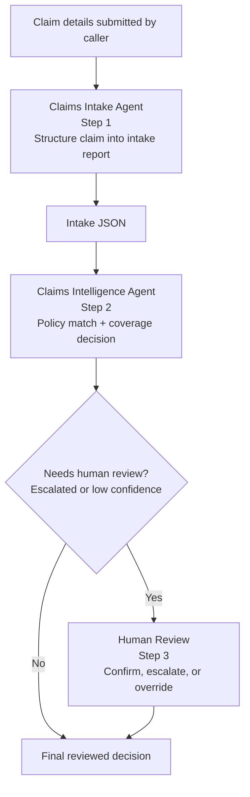

# Challenge 3 - Build the Sequential Claims Processing Workflow

**Expected Duration:** 75 minutes

## Overview

In this challenge you will wire the two agents from Challenges 1 and 2 into a single sequential workflow using **Microsoft Agent Framework** — the next-generation successor to Semantic Kernel and AutoGen.

The workflow uses the Functional Workflow API (`@workflow` + `@step` decorators), which lets you express multi-agent orchestration as plain Python async functions with no graph configuration required.

## From Two Agents to One Sequential Workflow

Challenge 1 created the Claims Intake Agent and Challenge 2 created the Claims Intelligence Agent. Challenge 3 connects those two agents into a single orchestration layer so the intake output becomes the intelligence input without manual handoff code.

In short: **claim details → Claims Intake Agent → intake JSON → Claims Intelligence Agent → conditional human review → final coverage decision**. The workflow is the glue that preserves ordering, keeps the handoff explicit, and lets the second agent reuse the structured output from the first while still allowing a person to confirm higher-risk decisions.

The workflow executes two core steps in strict order, with a conditional third human-review step when the coverage decision needs confirmation:



1. **Claims Intake Agent** — structures the claim details into a clean intake JSON report.
2. **Claims Intelligence Agent** — receives the intake report, matches the policy, validates coverage, and emits a decision that may require human confirmation.
3. **Human Review** — only runs when the decision is low-confidence or escalated and needs a person to confirm, escalate, or override the result.

```
claim details (submitted by caller)
     │
     ▼
┌─────────────────────┐
│  Claims Intake Agent │  (Step 1) Structure claim into intake report
└─────────┬───────────┘
          │  intake JSON
          ▼
┌──────────────────────────────┐
│  Claims Intelligence Agent   │  (Step 2) Policy match + Coverage decision
└──────────────────────────────┘
          │  coverage decision (APPROVED / DENIED / ESCALATED)
        ▼
┌──────────────────────────────┐
│   Human Review (conditional) │  (Step 3) Confirm, escalate, or override
└─────────┬────────────────────┘
        │  final reviewed decision
          ▼
     workflow output
```

## Prerequisites

- Complete [Challenge 1](./challenge-01.md) and [Challenge 2](./challenge-02.md).
- Install the Microsoft Agent Framework and Azure Identity:

```bash
pip install agent-framework azure-identity
```

- `FOUNDRY_PROJECT_ENDPOINT` and `FOUNDRY_MODEL` must be present in your `.env`.
