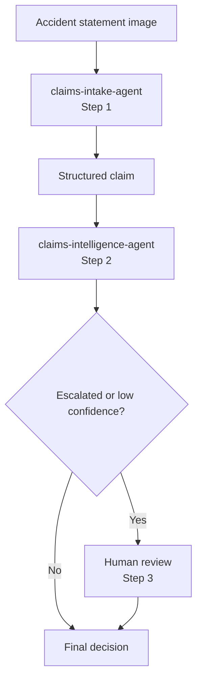

# Challenge 4 - Orchestrate the Two-Agent Claims Workflow

[Home](../README.md)

**Expected Duration:** 45 minutes

## Overview

Challenges 2 and 3 created two Foundry agents. This challenge runs those existing
agents in sequence without redefining their instructions or duplicating their policy
rules:

1. `claims-intake-agent` from Challenge 2
2. `claims-intelligence-agent` from Challenge 3

In short: **accident statement image -> intake agent -> structured claim -> policy
retrieval and coverage adjudication by the intelligence agent -> conditional human
review -> final decision**.



The structured intake and policy objects stay in memory. The workflow prints the final
decision and does not create another local JSON file.

## Prerequisites

- Complete [Challenge 2](./challenge-02.md) and [Challenge 3](./challenge-03.md).
- Keep the repository-root `.env` configuration used by those challenges.
- Synchronize the root Python environment if you have not already done so:

```bash
uv sync
```

- Confirm that `claims-intake-agent` and `claims-intelligence-agent` appear under
    **Agents** in your Foundry project. The intelligence agent is created by Challenge
    3 Task 2.

## Tasks

### Task 1: Confirm the two Foundry agents (no action needed)

Open your Foundry project and confirm that these agents are available:

- `claims-intake-agent`
- `claims-intelligence-agent`

> [!IMPORTANT]
> The supplied workflow implementation is complete. Do not modify the Python code. The
> workflow reuses the agents above and does not create replacement agents.

The workflow calls each agent for one responsibility. Human review is regular workflow
logic and does not appear as an agent in Foundry.

### Task 2: Run the sequential workflow

```bash
cd docs
python claims-sequential-workflow.py ../data/claims/crash1/raw/statements/crash1_front.jpeg --policy COMP-AUTO-001
```

This runs the approval path against the comprehensive policy. The workflow passes the
intake result to the intelligence agent, which retrieves and structures the policy in
memory before printing the final decision.

Test the default liability-only denial path:

```bash
python claims-sequential-workflow.py ../data/claims/crash1/raw/statements/crash1_front.jpeg
```

Override the claim identifier and amount when needed:

```bash
python claims-sequential-workflow.py ../data/claims/crash1/raw/statements/crash1_front.jpeg --policy COMM-AUTO-001 --claim-id CLM-2026-007 --amount 28000
```

If the decision is escalated or its confidence is below the configured threshold, the
workflow prompts you to approve, escalate, or deny it before printing the final result.

### How the workflow operates

| Step | Foundry resource | Input | Output |
|---|---|---|---|
| 1 | `claims-intake-agent` | OCR text from the accident statement | Structured claim and grounded statement context |
| 2 | `claims-intelligence-agent` | Structured claim and policy number | Foundry IQ-grounded policy plus an approved, denied, or escalated decision |
| 3 | None | Escalated or low-confidence decision | Human-confirmed or overridden final status |

The workflow cannot start Step 2 until the intake result supplies a policy number. The
intelligence agent retrieves and structures that policy before making its decision.

## Expected output

```text
Claims Sequential Workflow
  Endpoint : https://<resource>.services.ai.azure.com/api/projects/<project>
  Model    : gpt-5.4
    Image    : <repo>/data/claims/crash1/raw/statements/crash1_front.jpeg
  Policy   : COMP-AUTO-001
  Claim ID : CLM-2026-001

    [Step 1] claims-intake-agent running...
    [Step 1] Intake complete.
    [Step 2] claims-intelligence-agent running...
    [Step 2] Intelligence complete.

--- Final Decision ---
{
    "claim_id": "CLM-2026-001",
    "status": "APPROVED",
    "policy_info": {
        "policy_number": "COMP-AUTO-001"
    },
    "coverage_decision": {
        "is_covered": true,
        "applicable_deductible": 500.0,
        "approved_amount": 14500.0,
        "confidence_score": 0.97,
        "requires_escalation": false
    }
}

============================================================
CHALLENGE 4 COMPLETE
============================================================
    Step 1 - claims-intake-agent        complete
    Step 2 - claims-intelligence-agent  complete
    Step 3 - human review (conditional) not required
```

## Validation checklist

- The console lists the two agent steps in order.
- Challenge 4 reuses `claims-intelligence-agent` without creating a replacement.
- The final output contains `policy_info` and `coverage_decision` from the intelligence
    agent.
- `status` is `APPROVED`, `DENIED`, or `ESCALATED`.
- `approved_amount` uses the deductible and limit extracted from the real policy file.
- The liability-only command returns `DENIED` with `collision` or
    `own_vehicle_damage` in `exclusions_matched`.
- Human review runs only for an escalated or low-confidence decision.

## Next step

Continue with [Challenge 5](./challenge-05.md) to harden this pipeline against prompt injection and data exfiltration using FIDES.
